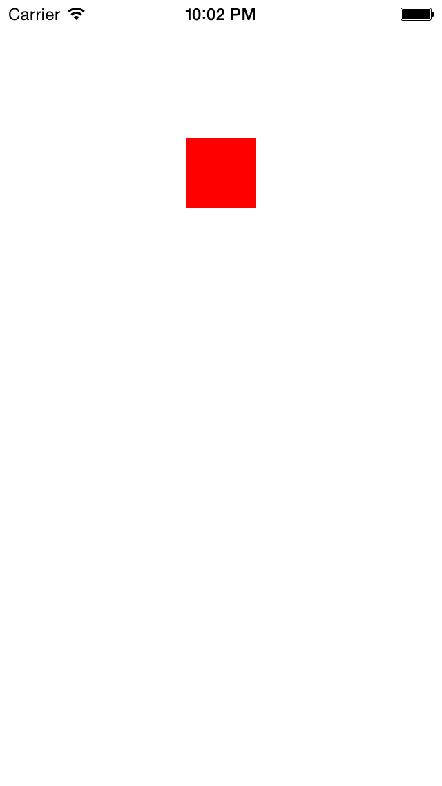

# ColorCodeUtils framework

this framework provide to you utility methods for color code.

## install

**write to the pod file First**

    pod 'ColorCodeUtils'

**run the command pod**
    
    > pod install

## usage
    #import <ColorCodeUtils/ColorCodeUtils.h>

    ColorCodeUtils *colorCodeUtils = [[ColorCodeUtils alloc] init];
    UIColor *color1 = [colorCodeUtils UIColorFromRGBString:@"FF0000"];
    //    UIColor *color2 = [colorCodeUtils UIColorFromRGBAString:@"FF0000" alphaValue:0.3f];
    //    UIColor *color3 = [colorCodeUtils UIColorFromRGB:0xFF0000];
    //    UIColor *color4 = [colorCodeUtils UIColorFromRGBA:0xFF0000 alphaValue:0.3f];
    UIView *view1 = [[UIView alloc] initWithFrame:CGRectMake(100, 50, 50, 50)];
    [view1 setBackgroundColor:color1];
    [self.view addSubview:view1];

## result

